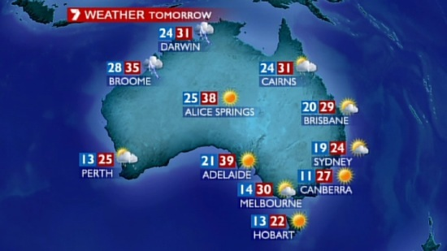
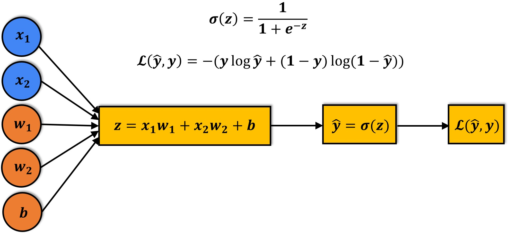
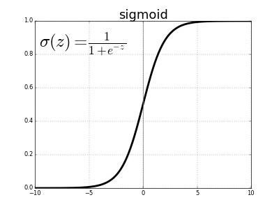

<h1 align="center">Weather Prediction Australia</h1>

<div align= "center"> 

<br/>

  <h4>Creating a fully-automated system that can use today's weather data for a given location to predict whether it will rain at the location tomorrow.</h4>
</div>

<br/>

# Table of Contents 

- [Table of Contents](#table-of-contents)
- [:warning: Frameworks and Libraries](#warning-frameworks-and-libraries)
- [:file_folder: Datasets](#file_folder-datasets)
  - [🔄 Source](#-source)
  - [🔥 Trainign Model](#-trainign-model)
- [:book: Data Preprocessing](#book-data-preprocessing)
- [:link: Download](#link-download)
- [:key: Prerequisites](#key-prerequisites)
- [🚀&nbsp; Installation](#-installation)
- [:bulb: How to Run](#bulb-how-to-run)
- [📂 Directory Tree](#-directory-tree)
- [:key: Results](#key-results)
- [:clap: And it's done!](#clap-and-its-done)
- [:raising_hand: Citation](#raising_hand-citation)
- [:heart: Owner](#heart-owner)
- [:eyes: License](#eyes-license)

<br/>

# :warning: Frameworks and Libraries

- **[Scikit-Learn](https://scikit-learn.org/):** 
Scikit-learn (Sklearn) is the most useful and robust library for machine learning in Python. It provides a selection of efficient tools for machine learning and statistical modeling including classification, regression, clustering and dimensionality reduction via a consistence interface in Python.
- **[Matplotlib](https://matplotlib.org/) :** Matplotlib is a comprehensive library for creating static, animated, and interactive visualizations in Python.
- **[Numpy](https://numpy.org/):**
  Caffe-based Single Shot-Multibox Detector (SSD) model used to detect faces
- **[Pandas](https://pandas.pydata.org/):**
  pandas is a fast, powerful, flexible and easy to use open source data analysis and manipulation tool, built on top of the Python programming language.
- **[Seaborn](https://seaborn.pydata.org/) :** Seaborn is a library for making statistical graphics in Python. It builds on top of matplotlib and integrates closely with pandas data structures.
- **[Plotly](https://plotly.com/python/) :** The plotly Python library is an interactive, open-source plotting library that supports over 40 unique chart types covering a wide range of statistical, financial, geographic, scientific, and 3-dimensional use-cases.
<br/>

# :file_folder: Datasets

## 🔄 Source

This dataset is a collected from [Kaggle](kaggle.com) repository named [Rain In Australia](https://www.kaggle.com/datasets/jsphyg/weather-dataset-rattle-package). This is a collection of daily weather data from previous 10 years in Australia.

<br/>

## 🔥 Trainign Model

To Train the model, used `Logistic Regression` which is a type of `Machine Learning` Algorithm

<br/>

<p align="center">
  
</p>

**Sigmoid:**

<br/>

<p align="center">
  
</p>

<br/>

# :book: Data Preprocessing

Data pre-processing is an important step for the creation of a machine learning
model. Initially, data may not be clean or in the required format for the model which
can cause misleading outcomes. In pre-processing of data, we transform data into our
required format. It is used to deal with noises, duplicates, and missing values of the
dataset. Data pre-processing has the activities like importing datasets, splitting
datasets, attribute scaling, etc. Preprocessing of data is required for improving the
accuracy of the model.

<br/>

# :link: Download

The dataset is now available [here](https://www.kaggle.com/datasets/jsphyg/weather-dataset-rattle-package) !

<br/>

# :key: Prerequisites

All the dependencies and required libraries are included in the file <code>requirements.txt</code> [See here](requirements.txt)

<br/>

# 🚀&nbsp; Installation

The Code is written in Python 3.7. If you don&rsquo;t have Python installed you can find it [here](https://www.python.org/downloads/). If you are using a lower version of Python you can upgrade using the pip package, ensuring you have the latest version of pip. To install the required packages and libraries, run this command in the project directory after [cloning](https://www.howtogeek.com/451360/how-to-clone-a-github-repository/) the repository:

1. Clone the repo

```bash
git clone https://github.com/Chaganti-Reddy/Weather-Prediction-Australia.git
```

2. Change your directory to the cloned repo

```bash
cd Weather-Prediction-Australia
```

3. Now, run the following command in your Terminal/Command Prompt to install the libraries required

```bash
python3 -m virtualenv my_env

source my_env/bin/activate

pip3 install -r requirements.txt

```

<br/>

# :bulb: How to Run

1. Open terminal. Go into the cloned project directory and type the following command:

```bash
python3 Weather-Prediction.py
```

<br/>

# 📂 Directory Tree

```
├── assets
│   ├── main1.jpg
│   ├── main.png
│   ├── Sigmoid.png
│   └── Training.png
├── aussie_rain.joblib
├── LICENSE
├── README.md
├── requirements.txt
├── test_inputs.parquet
├── test_targets.parquet
├── train_inputs.parquet
├── train_targets.parquet
├── val_inputs.parquet
├── val_targets.parquet
├── weather-dataset-rattle-package
│   └── weatherAUS.csv
├── Weather-Prediction.ipynb
└── Weather-Prediction.py
```

<br/>

# :key: Results

 **Our Regression Model has successfully predicted the output with an excellent accuracy via <code>Scikit-Learn</code>**

<br/>

# :clap: And it's done!

Feel free to mail me for any doubts/query
:email: chagantivenkataramireddy1@gmail.com

---

# :raising_hand: Citation

You are allowed to cite any part of the code or our dataset. You can use it in your Research Work or Project. Remember to provide credit to the Maintainer Chaganti Reddy by mentioning a link to this repository and his GitHub Profile.

Follow this format:

- Author's name - Chaganti Reddy
- Date of publication or update in parentheses.
- Title or description of document.
- URL.

# :heart: Owner

Made with :heart:&nbsp; by [Chaganti Reddy](https://github.com/Chaganti-Reddy/)

# :eyes: License

MIT © [Chaganti Reddy](https://github.com/Chaganti-Reddy/Weather-Prediction-Australia/blob/main/LICENSE)
